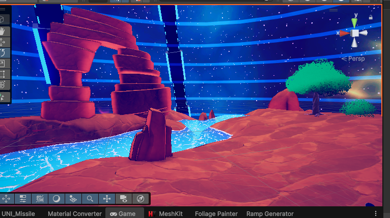

# ShadersLab - SSOutline (URP) 🖌️

> A robust, full-screen stylized outline solution for Unity URP using Render Graph / Scriptable Renderer Features.




This repository provides a versatile Screen-Space Outline effect that works via Depth, Normals, and Color edge detection. It supports **Occlusion Masking** (hiding outlines behind semi-transparent objects like water) and **Selective Masking** (outlining specific objects only).

---

## 📋 Table of Contents
- [ShadersLab - SSOutline (URP) 🖌️](#shaderslab---ssoutline-urp-️)
  - [📋 Table of Contents](#-table-of-contents)
  - [✨ Features](#-features)
  - [🚀 Installation](#-installation)
  - [🔌 Integration Guide (For Custom Shaders)](#-integration-guide-for-custom-shaders)
  - [🎮 Usage](#-usage)
    - [Key Parameters](#key-parameters)
  - [⚙ Configuration](#-configuration)
  - [📦 Compatibility](#-compatibility)
  - [⚡ Performance](#-performance)
  - [📝 Credits \& License](#-credits--license)

---

## ✨ Features

- **Multiple Algorithms:** Choose between **Sobel** (smooth, higher quality) or **Roberts Cross** (crisp, faster).
- **Selection Mode:** Outline only specific objects using Layer Masks.
- **Occlusion Support:** Prevents outlines from drawing over specific layers (e.g., Water, UI, Glass).
- **Distance & Height Fading:** Fade out outlines based on distance from camera or world height.
- **Debug Modes:** Visualize Depth, Normals, or the generated Masks directly in the Game View.
- **Render Graph Ready:** Built using modern Unity URP APIs for maximum compatibility with Unity 6.

---

## 🚀 Installation

1. Import the package/folder `Assets/Shaders/Outline` into your project.
2. Locate your **URP Renderer Data** asset (usually in `Settings/ForwardRenderer`).
3. Click **Add Renderer Feature** -> `Outline Feature`.
4. Ensure `Depth Texture` and `Opaque Texture` are enabled on your URP Asset.

---

## 🔌 Integration Guide (For Custom Shaders)

To ensure your custom shaders (especially vertex-animated foliage or transparent objects) work correctly with the **Selection Mode**, you **must** add a specific Pass to your shader.

The Outline Feature looks for a pass tagged `SelectionMask` (or fallback) to render the object into the mask buffer.

**Add this Pass to your Shader:**

```hlsl
Pass
{
    Name "SelectionMask"
    Tags { "LightMode" = "SelectionMask" }
    
    // Standard Rendering State
    ZWrite On
    ColorMask R // We only need the Red channel for the mask

    HLSLPROGRAM
    #pragma vertex Vertex
    #pragma fragment Fragment
    
    #include "Packages/com.unity.render-pipelines.universal/ShaderLibrary/Core.hlsl"

    // ... Your vertex struct and logic ...
    
    half4 Fragment(Varyings input) : SV_Target
    {
        // Setup logic (Clip alpha if needed)
        // clip(alpha - _Cutoff); 

        // Return solid Red
        return half4(1, 0, 0, 1);
    }
    ENDHLSL
}
```

*Note: The [ShadersLab-Biome](https://github.com/YourUsername/ShadersLab-Biome) repository is fully pre-configured with this pass.*

---

## 🎮 Usage

1. Add a **Global Volume** to your scene (or use an existing one).
2. Click **Add Override** -> `Custom` -> `Outline`.
3. Enable the checkbox to activate.

### Key Parameters

| Parameter           | Description                                                        | Default         |
| :------------------ | :----------------------------------------------------------------- | :-------------- |
| **Mode**            | `FullScreen`, `SelectionOnly`, or `Mixed`.                         | FullScreen      |
| **Selection Layer** | Layer mask for objects to outline (requires Selection Mode).       | Nothing         |
| **Occlusion Layer** | Layer mask for objects that should hide the outline (e.g., Water). | Nothing         |
| **Thickness**       | Width of the outline in pixels.                                    | 2               |
| **Thresholds**      | Sensitivity for Depth, Normal, and Color edge detection.           | 1.5 / 0.4 / 0.2 |

---

## ⚙ Configuration

- **Fixing Flickering:** If lines flicker on flat surfaces, increase the **Normal Threshold**.
- **Fixing Skybox Lines:** Increase **Depth Threshold** so the infinite depth of the skybox doesn't trigger an edge.
- **Soft vs Hard:** Use **Sobel** for softer, artistic lines. Use **Roberts Cross** for sharp, technical lines.

---

## 📦 Compatibility

- **Render Pipeline:** Unity 6.
- **Render Graph:** Fully supported.
- **VR:** Single Pass Instanced supported (Screen-space effects may vary on periphery). (Haven't test yet)

---

## ⚡ Performance

| Feature Enabled | ALU Cost |     Memory      |
| :-------------- | :------: | :-------------: |
| Basic Outline   |   Low    | 1 Fullscreen RT |
| Selection Mode  |  Medium  |  +1 R8 Texture  |
| Occlusion Mode  |  Medium  |  +1 R8 Texture  |

*Tip: Disable `Use Color` if you only need geometry outlines to save texture fetches.*

---

## 📝 Credits & License

- **Author:** [Bill The Dev](https://github.com/billtruong003)
- **License:** MIT

**Feel free to contribute or report issues!**  
[Discord](https://discord.gg/gYUSw7bF) | [Facebook](https://www.facebook.com/billthedev/) | [Youtube](https://www.youtube.com/@BillTheDev)
