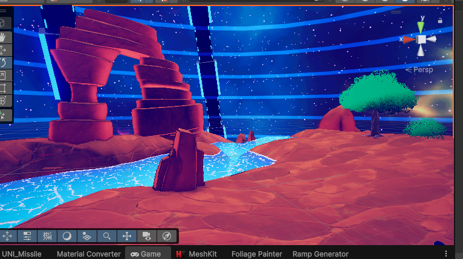

# Bill SS Outline (URP 17)

Full-screen stylised outline for Unity 6 / URP 17, built on the **Render Graph** API. Edges come from
depth, normals and colour; you can outline the whole screen, only objects on chosen rendering layers,
or both.



## Features

- **Edge detection:** depth, normals and colour; Sobel (smoother) or Roberts Cross (cheaper).
- **Modes:** `FullScreen`, `SelectionOnly` (rendering-layer mask), `Mixed`.
- **Occlusion mask:** keep outlines off chosen layers such as water or glass.
- **Fades:** by camera distance and by world height.
- **Line colour:** a fixed colour, or tinted and darkened from the object's own colour.
- **Resolution-independent width:** authored for a reference short side, scaled to the camera target;
  per-camera multiplier with `OutlineCameraWidth`.
- **Alpha-mask path for crowds:** shaders that write the mask into the colour alpha skip the second
  draw into the selection mask.
- **Debug views:** depth, normals, colour, edges only, mask, occlusion, scene alpha.

## Install

Package Manager → **Add package from git URL…**

```text
https://github.com/billtruong003/Bill-SSOutline.git#v2.0.0
```

Requires Unity 6000.0+ and URP 17 with Render Graph (compatibility mode off).

## Setup

1. **Renderer:** on your URP Renderer Data, **Add Renderer Feature ▸ Outline Feature**.
2. **Shaders:** add `Hidden/FullScreen/Outline` and `Hidden/Outline/SelectionMask` to
   **Project Settings ▸ Graphics ▸ Always Included Shaders**. The feature finds them by name, so a
   player build strips them otherwise.
3. **Volume:** on a Volume profile, **Add Override ▸ Post-processing ▸ Custom ▸ Outline**, tick
   **Is Active**, pick a mode.
4. **Selection (optional):** in **Project Settings ▸ Tags and Layers ▸ Rendering Layers**, name a
   layer such as `Outline`, put the renderers you want outlined on it, and choose it in
   **Selection Layer**.

## Volume settings

| Setting | |
|---|---|
| Mode | `FullScreen`, `SelectionOnly`, `Mixed` |
| Selection Layer / Occlusion Layer | rendering-layer masks |
| Algorithm | `Sobel`, `RobertsCross` |
| Use Depth / Normals / Color + thresholds | which edges count and how strong they must be |
| Thickness, Reference Short Side | width in pixels at the reference resolution |
| Outline Color, Tint Amount, Tint Darken | fixed colour or object-tinted line |
| Distance fade, Height fade | start/end ranges |
| Debug Mode | visualise each input |

## Code hooks

```csharp
using BillSSOutline;

// Layers drawn with their own "OutlineSelectionMask" pass (vertex-animated meshes, e.g. VAT)
OutlineOverrides.MaterialDrivenLayers = RenderingLayerMask.GetMask("Outline Enemy");

// Layers whose shaders call BillOutlineAlpha() (see below)
OutlineOverrides.AlphaCapableLayers = RenderingLayerMask.GetMask("Outline Enemy", "Outline Env");

// Drop normal edges (and the DepthNormals prepass) on low-end devices
OutlineOverrides.AllowNormals = () => QualitySettings.GetQualityLevel() >= 2;

// Runtime look overrides (QA, photo mode); null = volume value
OutlineOverrides.Colour = Color.black;
OutlineOverrides.Thickness = 3;
OutlineOverrides.Hidden = true;          // skips every outline pass
OutlineOverrides.ClearLook();
```

Look overrides reset at the start of every Play session.

## Custom shaders

**Selection by own pass.** Vertex-animated shaders must draw the mask themselves, or the silhouette
freezes in bind pose. Add a pass tagged `LightMode = OutlineSelectionMask` that outputs `1`, and put
its renderers on a layer listed in `OutlineOverrides.MaterialDrivenLayers`.

**Alpha mask.** For large crowds, write the mask into the colour alpha instead of drawing twice:

```hlsl
#include "Packages/com.bill.ss-outline/Shaders/OutlineAlphaMask.hlsl"
// at the end of the forward fragment:
color.a = BillOutlineAlpha(color.a);
```

`BillOutlineAlpha` returns 0 for renderers on the active alpha layers and 1 for everything else (or
your alpha unchanged when the path is off). The feature turns the path off for scene view, cameras
rendering into textures and colour formats without alpha.

## Optional: profile guard

Define **`BILL_OUTLINE_PROFILE_GUARD`** to make every scene Volume use a runtime copy of its profile
in Play Mode, so nothing written during play (code, debug tools, inspector tweaks) can change the
profile asset on disk.

## Performance notes

- The feature asks URP for the Color input only while it is active; that allocates an intermediate
  colour target and blocks native render-pass merging on mobile for that camera.
- Normal edges need the DepthNormals prepass, which redraws all opaques. Use `AllowNormals` to turn
  them off where they are not worth it.
- `Outline.shader` uses `multi_compile_local` for every option, so Always Included ships all
  combinations (about 768 variants). Strip the debug and occlusion keywords if build size matters.
- WebGL needs WebGL 2 (rendering-layer reads).

## License

MIT, see [LICENSE](LICENSE).
